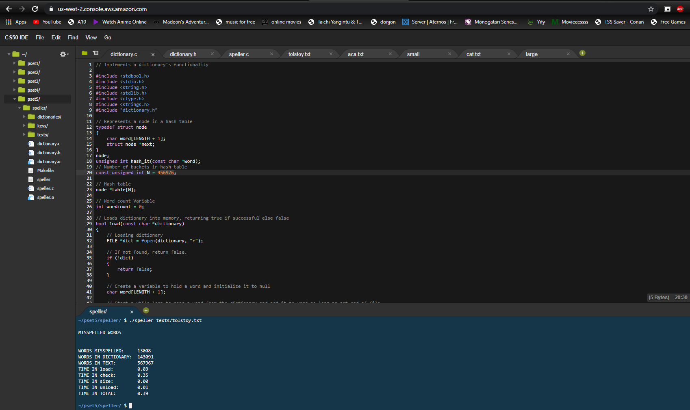

<!-- omit in toc -->
# CS50 Projects

Here are projects I worked on while undertaking the CS50 course online. All projects are done independently. I have worked to ensure I can maximize speed and efficiency of these programs:

These programs will showcase my implementation of advanced algorithms, as well as my ability to solve complex problems. Here is a table of contents:

- [List by Complexity](#list-by-complexity)
  - [**Speller**](#speller)
  - [**Recover**](#recover)
  - [**Filter**](#filter)
  - [**Tideman**](#tideman)
  - [**Plurality**](#plurality)
  - [**Substitution**](#substitution)
  - [**Credit**](#credit)
  - [**Readability**](#readability)
  - [**Mario**](#mario)
  - [**Hello**](#hello)

## List by Complexity

### [**Speller**](speller)

Speller corrects the spelling of words based on a dictionary that is loaded into a hash table. Using efficient hash functions for optimal speeds.

### [**Recover**](recover)

Recover is a program which uses a memory sifting algorithm to look through a memory card with deleted images and extracts JPEG images from that card, detecting JPEG signatures and writing JPEG images into new files.

### [**Filter**](filter)

Filter manipulates image data to apply instagram filters, including blur and edge detection algorithms. Works on Bitmap files, or BMP.

### [**Tideman**](tideman)

Tideman uses a bubble sorting algorithm to sort voting ballots based on top choice and ranking of other candidates.

### [**Plurality**](plurality)

Plurality Uses single voting ballots, where each voter only votes on one person, then decides on a winner based on who got the most votes.

### [**Substitution**](substitution)

This program uses a Caesar encryption algorithm to encrypt messages using a given key.

### [**Credit**](credit)

Credit will check the validity of a user entered credit card number, and will figure out if its a MasterCard, a Visa, or an American Express.

### [**Readability**](readability/readability.c)

This will check the readability level of a specific inputted paragraph.

### [**Mario**](mario)

Mario will recreate the double pyramids in the mario game using # with height input from the user, limited to 1-8 inclusive.

### [**Hello**](hello)

Start of every developer's journey, the hello world program. This time with Input!
