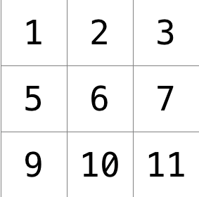

<!-- omit in toc -->
# Filter

This program will take a bitmap(.bmp) file containing an image and apply a filter to it. This supports 4 filters: GrayScale, reflect, blur, edge detection.

Table of contents:

- [Usage](#usage)
- [Logic](#logic)
  - [Background](#background)
  - [GrayScale](#grayscale)
  - [Reflect](#reflect)
  - [Blur](#blur)
  - [Edge](#edge)

<!-- omit in toc -->
## Examples

<!-- omit in toc -->
### Original Picture


<!-- omit in toc -->
### Edge Detection


## Usage

```C
$ ./filter //FILTER ARGUMENT (-g, -e, -r, -b) //INPUT FILE //OUTPUT FILE
```

## Logic

There are different logical approaches for each filter. I will be explaining these approaches one by one, starting with the least complex and working our way up.

### Background

First, we need to understand a couple of things about how the program operates. First, I will be working on the file "helpers.c". This file contains the function prototypes ready for image manipulation. What I mean is, Other files in this program, such as "filter.c" and "bmp.h" create the necessary custom defined structures that contain, RGB values for each pixel in the image based on height and width. I will be manipulating these values to achieve each filter. I will be explaining how I manipulated these values to achieve these results, and the logic behind it.

### GrayScale

GrayScale will add a gray filter to the image.

To explain how it works, lets imagine a a single pixel and its RGB values. For the sake of discussion, lets say this pixel is pink, and its value is `[255, 100, 100]`. To make this pixel gray, we need to average out all the values and make them all into the same one value. How do we average them out? Simple, we just find the mean of these values.

<div align="center"></div>

After we calculate the mean, We simply make all RGB values equal to that mean. Our new pixel would be `[152, 152, 152]`

This pixel would be a gray pixel appropriate for the given color. Now we simply repeat this process for all pixels in the image using a nested loop to go through both width and height.

### Reflect

Reflect will add a filter that mirrors the image.

Reflect will not work with RGB values and instead will work with pixels as a whole. What it will do is, it will loop through the half the image starting from the left. During that loop, it will take the current pixel and replace it with the corresponding pixel on the other half. Basically, it takes the middle line of pixels as a mirror, or a reference point, and keeps swapping pixels from the left side and the right side till it reaches the middle.

### Blur

Blur will add a nice blur effect to the image.

To blur an image, we need to first understand how a pixel can be blurred correctly. to do that, we need to take a look at a kernel (3x3 pixel).



This is a 3 by 3 grid, with each pixel containing its own RGB values. To blur this whole grid, we need to change each pixel based on the average of the color values all the pixels around it, including itself. For example, if we want to blur pixel 6, we would need to average out the RGB values of pixels 1, 2, 3, 5, 6, 7, 9, 10, 11. 6 would then have its Red value changed to the average of all red values, its green value changed to the average of all green values, and its blue value changed to the average of all blue values.

Note that we only look at the surrounding pixels. Even when on an edge or a corner. For example, if we want to blur pixel 1, we need to average out the RGB values of 1, 2, 5, and 6.

### Edge

Edge will detect edges in an image and highlight them.

This filter is a little harder to implement. We would be using the same concept of kernels introduced in blur, but in a completely different manner. In artificial intelligence, lots of edge detection algorithms are used these days, and most depend on whats called the [Sobel Operator](https://en.wikipedia.org/wiki/Sobel_operator)

To explain the sobel operator simply, we will take a look at the two sobel operator kernels.


How do we read or use these kernels? Basically, we will be calculating two weighted sums for each pixel. One is calculated to check for edges horizontally. ANd one is calculated to check for edges vertically. To compute Gx for the red values of a pixel, for example, we take all red values of the surrounding pixels and multiply each one by the corresponding value in the Gx kernel, and add everything to a sum for red values. So the red value in the top left corner will be multiplied by -1, the red value in top middle will be multiplied by 0, the red value in top right corner will be multiplied by 1, and so on for all 9 pixels. For the purposes of this program, however, we will consider the image to have a black border around it when calculating corner pixels.

Why were these values chosen for the sobel operator? Well lets take Gx, the kernel used for the horizontal edges calculation. We multiply the pixel left of the current pixel by a negative value, and multiply the pixel right of the current pixel by a positive value. If the colors of these pixels are similar, taking the sum would give us a near-zero value, meaning there is no edge detected here. However, if the pixels were different, the resulting sum will either be a very positive value or a very negative value, indicating that there is a huge change in color here, which could be an edge.

If you have noticed, we are taking two different values for each color, a Gx value and a Gy value. However, we know that RGB values only take in 1 number. Therefore, once we get those values, we simply take the square root of the sum of the squares of these values, as follows:

<div align="center"></div>

Moreover, since the maximum value for a channel is 255, we need to cap the result at 255 if its anything above that number.
